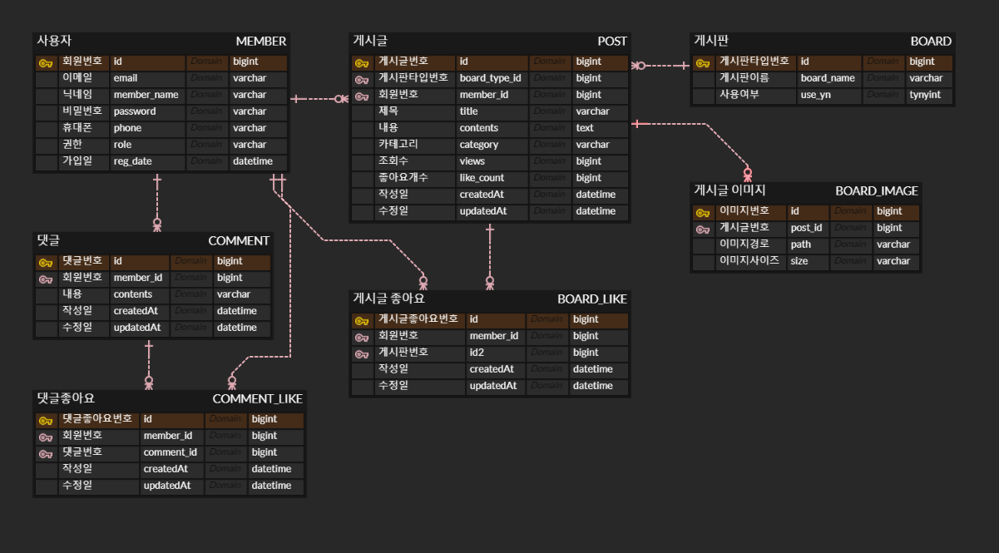

# 커뮤니티 게시판

사용자의 니즈(Needs)에 맞게 관리자가 게시판을 제공하고 이용할 수 있는 게시판입니다.

## 1️⃣Tech Stack

## 2️⃣ERD

## 3️⃣프로젝트 기능 및 설계

### ✅ Member API

#### 1.회원가입
- 모든 사용자는 회원가입을 할 수 있으며 일반 회원으로 가입됩니다.
- 일반회원, 관리자 2개의 권한이 있으며, 별도의 관리자 회원가입 API는 제공하지 않습니다.
- 이메일, 닉네임, 패스워드, 휴대폰번호, 프로필이미지를 입력 받습니다.
- 회원 가입시 이메일 인증을 수행합니다.

#### 2.로그인
- 회원정보와 일치할 경우 로그인을 할 수 있습니다.
- 로그인시 AccessToken, RefreshToken을 발급합니다.

#### 3.로그아웃
- 로그인한 회원은 로그아웃 처리됩니다.
- Redis에 저장된 RefreshToken을 삭제하고 AccessToken을 BlackList 처리합니다.

#### 4.토큰 재발급
- RefreshToken의 기간이 남아있고 AccessToken이 만료된 경우 AccessToken과 RefreshToken을 새로 발급합니다.

#### 5.회원정보 조회
- 이메일, 닉네임, 휴대폰번호, 프로필 이미지를 조회할 수 있습니다.

#### 6.회원정보 수정
- 닉네임,패스워드,휴대폰번호, 프로필 이미지를 수정할 수 있습니다.

#### 7.회원 탈퇴
- 회원탈퇴시 상태가 RESIGN으로 변경됩니다.
- 30일이 지나면 회원정보를 완전히 삭제합니다.

#### 8.비밀번호 찾기
- 이메일 인증을 통해 임시 비밀번호를 발급 받습니다.

### ✅ Admin API

#### 1. 회원 권한 조정
- 회원 권한을 변경할 수 있습니다.(USER, ADMIN)

#### 2. 게시판을 생성
- 게시판을 생성할 수 있습니다.

#### 3. 게시판 상태 변경
- 게시판을 활성화 또는 비활성화 시킵니다.
- 비활성화 기간이 1년이 지나면 게시판을 삭제합니다.

### ✅ Post API

#### 1. 게시판 글 작성
- 게시판 작성은 로그인한 사용자만 가능합니다.
- 사용자는 제목,내용,사진을 이용하여 게시할 수 있습니다.
- 사진은 AWS S3을 이용하여 저장 및 관리 합니다.

#### 2.게시판 글 수정
- 작성자는 본인이 작성한 글을 수정할 수 있습니다.

#### 3.게시판 글 삭제
- 작성자는 본인이 작성한 글을 삭제할 수 있습니다.
- 관리자는 모든 게시판의 글을 삭제할 수 있습니다.

#### 4.게시판 목록 조회
- 모든 사용자는 게시글을 조회할 수 있습니다.
- 게시글은 최신순으로 정렬되고, 조회수 및 좋아요 개수로 정렬 가능합니다.
- 게시글은 paging 처리를 하여 보여줍니다.

#### 5.게시글 좋아요
- 로그인한 사용자는 권한에 관계 없이 좋아요를 누를 수 있습니다.
- 좋아요 기능은 게시글당 1회만 가능합니다.

### ✅ Comment API
#### 1.댓글 작성 기능
- 로그인한 사용자는 권한에 관계 없이 댓글을 작성할 수 있습니다.

#### 2.댓글 수정 기능
- 작성자는 본인이 작성한 댓글을 수정할 수 있습니다.

#### 3.댓글 삭제 기능
- 작성자는 본인이 작성한 댓글을 삭제할 수 있습니다.
- 관리자는 모든 게시판의 댓글을 삭제할 수 있습니다.

#### 4.댓글 목록 조회 기능
- 모든 사용자는 댓글을 조회할 수 있습니다.
- 댓글은 최신 순으로만 정렬되며 Paging처리를 합니다.